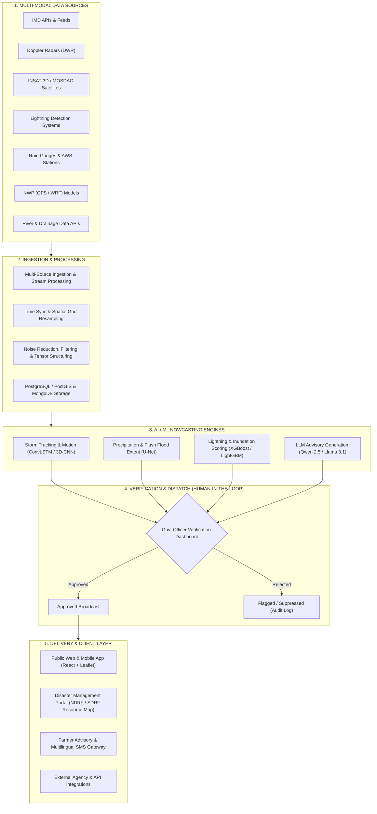

# ⛈️ DRISHTI — AI/ML-Powered Weather Nowcasting & Disaster Management Platform

<div align="center">


-green?style=for-the-badge)


**AIML-based Nowcasting of Thunderstorm and Lightning using Atmospheric Observations (Multi-Radar, Satellite, Lightning, and NWP Model Data)**

[Live Demo](#-getting-started) • [System Architecture](#-system-architecture) • [AI/ML Models](#-aiml--deep-learning-pipeline) • [Key Features](#-key-features) • [Tech Stack](#-technology-stack)

</div>

---

## 📌 Executive Summary

**DRISHTI** is an enterprise-grade, hyper-local **Weather Nowcasting and Disaster Management Platform** engineered to predict severe atmospheric events—such as thunderstorms, heavy precipitation, lightning strikes, and urban flash floods—up to **0 to 6 hours in advance**.

By fusing heterogeneous data streams (Doppler Weather Radars, INSAT/MOSDAC Satellites, Lightning Location Detection Systems, Automatic Weather Stations, and Numerical Weather Prediction models) with cutting-edge Deep Learning architectures (**ConvLSTM, U-Net, 3D-CNN, XGBoost**), DRISHTI bridges the critical gap between multi-sensor meteorological data and real-time public safety actions.

---

## 🎯 Smart India Hackathon (SIH 2026) Problem Details

| Parameter | Details |
|---|---|
| **Problem Statement ID** | **SIH26072** |
| **Problem Statement Title** | AIML based Nowcasting of thunderstorm and lightning using atmospheric observation including multiple radars, satellite, lightning and model data. |
| **Theme** | **Disaster Management** |
| **Category** | Software |
| **Team ID** | **161373** |
| **Team Name** | **phantom** |

---

## 🌟 Key Features & Capabilities

### ⚡ 1. Hyper-Local 0–6 Hour Nowcasting
- High-resolution spatial and temporal tracking of convective storm cells.
- Precision precipitation rate forecasting and lightning strike likelihood mapping.

### 🛰️ 2. Multi-Sensor Data Ingestion & Fusion
- Simultaneous ingestion and grid alignment of:
  - **Doppler Weather Radars (DWR)**: Reflectivity ($Z$), Radial Velocity ($V$), and Spectral Width ($W$).
  - **Satellite Observations**: INSAT-3D/3DR / MOSDAC multispectral and thermal infrared imagery.
  - **Lightning Detection Systems**: Ground-based lightning flash density and polarity.
  - **Automatic Weather Stations (AWS) & Rain Gauges**: Surface temperature, humidity, pressure, and instantaneous precipitation.
  - **NWP Models**: GFS / WRF synoptic scale boundary conditions.

### 🛡️ 3. Human-in-the-Loop Emergency Verification
- Severe model-generated alerts route directly to an **Official Government Verification Dashboard**.
- Authorizing officers validate high-severity triggers before triggering automated multi-channel public broadcasts, eliminating panic caused by false positives.

### 🌊 4. Dynamic Urban Inundation & Risk Mapping
- Interactive Leaflet-powered GIS dashboard overlaying live storm vectors on flood-prone urban choke points, elevation contours, and drainage basins.

### 🌾 5. Agricultural & Farmer Advisory Engine
- Multilingual, plain-language advisories powered by LLMs (**Qwen 2.5 / Llama 3.1**) guiding sowing, irrigation, fertilizer scheduling, and livestock protection.

### 🚨 6. Multi-Channel Alert & Dispatch Engine
- Color-coded alerts (**Green / Yellow / Orange / Red**) broadcasted over:
  - SMS & Voice Gateway (rural reach)
  - Push Notifications & Mobile Web
  - Webhook APIs for emergency services
  - Interactive Disaster Management Command Portal

### 🚒 7. Emergency Resource & Asset Deployment
- Pinpoint mapping and rapid dispatch coordination for **NDRF / SDRF** disaster response units, high-capacity drainage pumps, emergency medical teams, and shelters.

### ⏪ 8. Historical Event Replay & Model Validation
- Timeline scrubber to simulate, review, and benchmark previous extreme weather occurrences against ground-truth station observations.

---

## 🏗️ System Architecture



---

## 🧠 AI/ML & Deep Learning Pipeline

| Task / Objective | Model Architecture | Input Features | Output Target |
|---|---|---|---|
| **Convective Storm Motion (0-6h)** | **ConvLSTM & 3D-CNN** | Radar Reflectivity Sequences ($T_{-60\text{min}} \to T_0$) | 2D/3D Spatiotemporal storm radar extrapolation |
| **Heavy Rainfall & Cloud Inundation** | **U-Net** | Satellite TIR, Water Vapor channels + Radar dBZ | Pixel-level precipitation intensity & flood extent mask |
| **Lightning Stroke Probability** | **XGBoost / LightGBM / RF** | CAPE, Lifted Index, Cloud Top Temp, AWS Hum/Temp | Binary/Probabilistic risk of lightning strikes per sector |
| **Localized Advisory Generation** | **Qwen 2.5 / Llama 3.1** | Forecast metrics, affected crop types, district names | Multi-language situational advisories (English, Hindi, etc.) |

### Training Datasets & Benchmarks
- **SEVIR** (Spatiotemporal Environmental Variety Image & Radar dataset)
- **MeteoNet** (Comprehensive French & European meteorological dataset)
- **NOAA NEXRAD** (Next Generation Weather Radar archive)
- **IMD Mausam / Mausamgram / NDMA SACHET** standard protocols

---

## 📊 Competitive Matrix & Comparative Advantage

| Feature / Capability | Public IMD Apps | IMD MHEW-DSS | Commercial Weather APIs | AI Weather Research | **DRISHTI (Our Platform)** |
|:---|:---:|:---:|:---:|:---:|:---:|
| **Basic Weather Forecasts & Radar** | ✅ | ✅ | ✅ | ✅ | ✅ |
| **AI-Based Short-Term Nowcasting (0–6h)** | ❌ | ⚠️ | ⚠️ | ✅ | ✅ |
| **Multi-Sensor Fusion (Radar+Sat+Lightning+AWS)**| ❌ | ✅ | ⚠️ | ❌ | ✅ |
| **Dynamic Inundation & Waterlogging Mapping** | ❌ | ✅ | ❌ | ❌ | ✅ |
| **Human-in-the-Loop Govt Command Control (RBAC)**| ❌ | ✅ | ❌ | ❌ | ✅ |
| **Farmer Advisory & Multilingual SMS Translation** | ❌ | ❌ | ❌ | ❌ | ✅ |
| **Emergency Resource Mapping (NDRF/SDRF Dispatch)**| ❌ | ⚠️ | ❌ | ❌ | ✅ |
| **Citizen Reporting & Ground-Truth Crowdsourcing**| ❌ | ❌ | ❌ | ❌ | ✅ |

---

## 💻 Technology Stack

### Frontend & Visualizations
- **Framework**: [React.js](https://react.dev/) with [Vite](https://vitejs.dev/)
- **Styling & UI**: [Tailwind CSS](https://tailwindcss.com/) & [Lucide Icons](https://lucide.dev/)
- **Geospatial & Mapping**: [Leaflet](https://leafletjs.com/) & [React-Leaflet](https://react-leaflet.js.org/)
- **State & Internationalization**: React Context API (`LanguageContext`, `AppContext`)

### Backend & API Services (Architecture Spec)
- **API Engine**: [FastAPI](https://fastapi.tiangolo.com/) (Python) & [Node.js / Express.js](https://expressjs.com/)
- **Authentication**: JWT, Role-Based Access Control (RBAC), OTP Verification
- **Databases**: [PostgreSQL](https://www.postgresql.org/) with [PostGIS](https://postgis.net/), [MongoDB](https://www.mongodb.com/)

### AI / ML & Computational Engines
- **Deep Learning**: [PyTorch](https://pytorch.org/), [TensorFlow / Keras](https://www.tensorflow.org/), [OpenCV](https://opencv.org/)
- **Machine Learning**: [Scikit-learn](https://scikit-learn.org/), [XGBoost](https://xgboost.readthedocs.io/), [LightGBM](https://lightgbm.readthedocs.io/)
- **LLM Synthesis**: Qwen 2.5 / Llama 3.1

### DevOps & Infrastructure
- **Containerization**: [Docker](https://www.docker.com/)
- **CI/CD & Cloud**: GitHub Actions, AWS / GCP / Azure Deployment

---

## 👥 Role-Based Access Control (RBAC) Architecture

DRISHTI provides role-tailored dashboards to ensure each stakeholder receives actionable intelligence:

```
├── 🏛️ Government Portal (/government)
│   ├── Pending Verification Queue (Human-in-the-loop broadcast approval)
│   ├── District-Level Threshold Tuning
│   └── Multi-Agency Incident Escalation
│
├── 🛡️ Emergency & Disaster Management (/emergency)
│   ├── NDRF / SDRF Personnel & Asset Mapping
│   ├── High-Capacity Pump & Evacuation Route Management
│   └── Live Incident Response Log
│
├── 👤 Citizen & Farmer Portal (/user)
│   ├── Hyper-Local Weather Nowcast & Live Risk Gauge
│   ├── Crop Protection & Agronomic Advisories
│   ├── Multilingual Lightning & Flash-Flood Safety Guidance
│   └── Nearby Relief Shelters Locator
│
├── 🔔 Alerts & Notifications Hub (/alerts)
│   ├── Color-Coded Severe Weather Feed (Red / Orange / Yellow)
│   └── Multi-channel Broadcast Audit Log
│
└── ⚙️ Admin Console (/admin)
    ├── Station & Radar Feed Health Monitoring
    └── User Management & Access Logs
```

---

## 🚀 Getting Started

### Prerequisites
- **Node.js**: v18.0.0 or higher
- **npm** or **yarn** / **pnpm**

### Installation

1. **Clone the Repository**
   ```bash
   git clone https://github.com/GabimaruT/Drishti-demo.git
   cd Drishti-demo
   ```

2. **Install Dependencies**
   ```bash
   npm install
   ```

3. **Launch Development Server**
   ```bash
   npm run dev
   ```

4. **Open in Browser**
   Navigate to `http://localhost:5173` to explore the DRISHTI platform.

### Build for Production
```bash
npm run build
npm run preview
```

### 🌐 Deploying to GitHub Pages

#### Option A: Automatic via GitHub Actions (Recommended)
1. Push your code to GitHub:
   ```bash
   git add .
   git commit -m "Configure GitHub Pages deployment"
   git push origin main
   ```
2. In your GitHub repository:
   - Go to **Settings** → **Pages**.
   - Under **Build and deployment** > **Source**, select **GitHub Actions**.
   - Your site will automatically build and deploy at:
     `https://GabimaruT.github.io/Drishti-demo/`

#### Option B: Manual Deploy via CLI
```bash
npm run deploy
```

---

## 📈 Socio-Economic Impact & Benefits

1. **Disaster & Emergency Response**:
   - Reduces notification latency from hours to seconds.
   - Enables pre-positioning of NDRF rescue boats, dewatering pumps, and ambulances before road inundation occurs.
2. **Agricultural & Rural Resilience**:
   - Saves livestock and prevents farm casualties with advance lightning warnings.
   - Prevents fertilizer and pesticide wash-off by alerting farmers before heavy downpours.
3. **Urban Infrastructure Defense**:
   - Triggers automated activation of storm-water drainage pumps in smart cities.
   - Informs airport ground ops, rail networks, and construction sites to halt high-risk outdoor tasks during active lightning cells.

---

## 📚 References & Data Sources

- **IMD Mausam Portal**: [https://mausam.imd.gov.in/](https://mausam.imd.gov.in/)
- **IMD Open API Gateway**: [https://api.imd.gov.in/](https://api.imd.gov.in/)
- **MOSDAC (ISRO Satellite Data)**: [https://www.mosdac.gov.in/](https://www.mosdac.gov.in/)
- **NDMA SACHET Early Warning Portal**: [https://sachet.ndma.gov.in/](https://sachet.ndma.gov.in/)
- **WMO Multi-Hazard Early Warning Systems (MHEWS)**: World Meteorological Organization Early Warning Directives.

---

## 👥 Team Details — Team phantom

- **Team ID**: `161373`
- **Hackathon**: Smart India Hackathon (SIH) 2026
- **Problem Statement**: `SIH26072` (Disaster Management)

---

<div align="center">
  <sub>Built with ❤️ by <b>Team phantom</b> for Smart India Hackathon 2026</sub>
</div>
